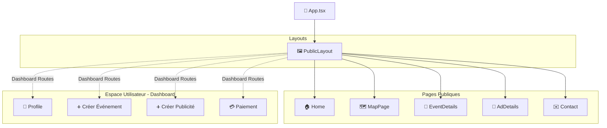

```mermaid

graph TD

App[🚀 App.tsx]

subgraph Layouts

PublicLayout[🖼️ PublicLayout]

end

subgraph Pages_Publiques [Pages Publiques]

Home[🏠 Home]

MapPage[🗺️ MapPage]

EventDetails[📅 EventDetails]

AdDetailsPage[📢 AdDetails]

ContactPage[✉️ Contact]

end

subgraph Pages_Dashboard [Espace Utilisateur - Dashboard]

Profile[👤 Profile]

CreateEvent[➕ Créer Événement]

CreateAd[➕ Créer Publicité]

Payment[💳 Paiement]

end

%% Routing Logic

App --> PublicLayout

PublicLayout --> Home

PublicLayout --> MapPage

PublicLayout --> EventDetails

PublicLayout --> AdDetailsPage

PublicLayout --> ContactPage

%% Dashboard is also under PublicLayout currently

PublicLayout -.->|Dashboard Routes| Profile

PublicLayout -.->|Dashboard Routes| CreateEvent

PublicLayout -.->|Dashboard Routes| CreateAd

PublicLayout -.->|Dashboard Routes| Payment
```