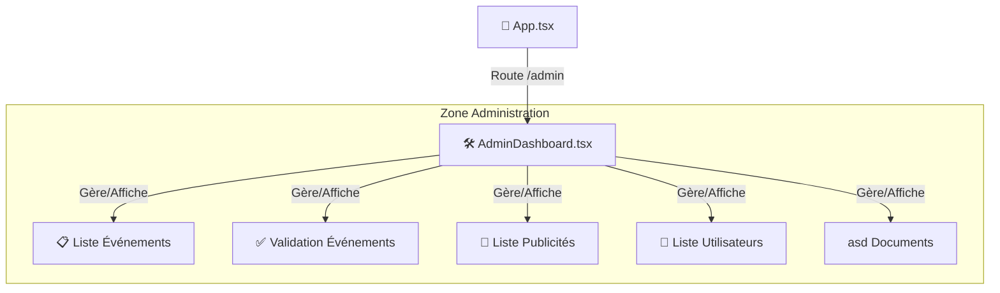

```mermaid
graph TD

App[🚀 App.tsx]

subgraph Admin_Zone [Zone Administration]

AdminDash[🛠️ AdminDashboard.tsx]

%% Sub-routes defined in App.tsx or inside Admin structure

EventsList[📋 Liste Événements]

EventsValidate[✅ Validation Événements]

AdsList[📢 Liste Publicités]

UsersList[👥 Liste Utilisateurs]

Docs[asd Documents]

end

App -->|Route /admin| AdminDash

AdminDash -->|Gère/Affiche| EventsList

AdminDash -->|Gère/Affiche| EventsValidate

AdminDash -->|Gère/Affiche| AdsList

AdminDash -->|Gère/Affiche| UsersList

AdminDash -->|Gère/Affiche| Docs

```